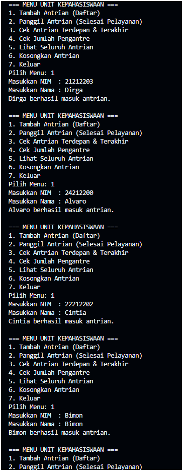

|  | Algorithm and Data Structure |
|--|--|
| NIM |  254107020241|
| Nama |  Hikmal Fadhillah Rasyid Andro Mulyawan |
| Kelas | TI - 1F |
| Repository | [link] (https://github.com/jti-polinema/-01-contoh-laporan-react) |

# Labs #1 Programming Fundamentals Review

## 2.1.1. Selection Solution

The solution is implemented in Pemilihan1.java, and below is screenshot of the result.

![Screenshot]
![Screenshot]
![Screenshot]
![Screenshot]![alt text]
![Screenshot]![alt text]
![Screenshot]
![Screenshot]

**Brief explanaton:** There are 4 main step: 

Percobaan 1:
1. Karena pada baris tersebut, objek sll baru saja diinstansiasi (new SingleLinkedList00()) dan belum ada proses penambahan data (addFirst / addLast) sama sekali, sehingga pointer head masih bernilai null.
2. Variabel temp atau tmp berfungsi sebagai pointer helper (penunjuk bantuan) untuk melakukan penelusuran (traversing) dari satu node ke node berikutnya tanpa merubah posisi head asli dari linked list.
3. 

Percobaan 2:
1. Keyword `break` digunakan untuk menghentikan proses perulangan (`while`/`looping`) pencarian data segera setelah node yang dicari ditemukan dan dihapus. Jika tidak di-`break`, perulangan akan terus berjalan sia-sia sampai akhir list.
2. * Baris `temp.next = temp.next.next;` digunakan untuk melewati (*skip*) node yang ingin dihapus dengan cara menyambungkan pointer `next` dari node saat ini langsung ke node setelah node yang dihapus.
     * Blok `if (temp.next == null) { tail = temp; }` berguna untuk memperbarui pointer `tail`. Jika setelah penghapusan ternyata node `temp` berada di paling ujung akhir linked list (`temp.next` menjadi `null`), maka node `temp` tersebut secara otomatis resmi menjadi `tail` yang baru.

Tugas:

## 2.1.1. Selection Solution
Continue to report the result....
