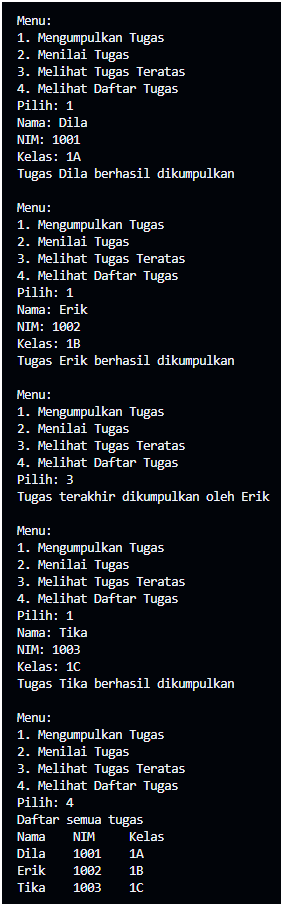
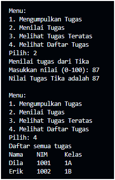

|  | Algorithm and Data Structure |
|--|--|
| NIM |  254107020241|
| Nama |  Hikmal Fadhillah Rasyid Andro Mulyawan |
| Kelas | TI - 1F |
| Repository | [link] (https://github.com/jti-polinema/-01-contoh-laporan-react) |

# Labs #1 Programming Fundamentals Review

## 2.1.1. Selection Solution

The solution is implemented in Pemilihan1.java, and below is screenshot of the result.

**Brief explanaton:** There are 4 main step: 
1. Input all grades
2. Validate the input
3. Calculate and convert the final grade
4. Decide the final status

## 2.1.1. Selection Solution
Percobaan 1:
1. yang perlu diperbaiki ialah urutan penampilan data pada method print(). Untuk menyesuaikan dengan konsep LIFO (Last In First Out) pada Stack di mana data yang baru masuk berada di atas, perulangan harus dilakukan secara terbalik (dari indeks top ke 0).
2. Kapasitas maksimal adalah 5 data.

3. Pengecekan !isFull() diperlukan untuk mencegah Stack Overflow. Jika kondisi tersebut dihapus dan program tetap mencoba menambah data saat array sudah penuh, maka akan terjadi error ArrayIndexOutOfBoundsException karena program mengakses indeks di luar kapasitas array yang ditentukan.
4. 

Percobaan 2:
1. Method konversiDesimalKeBiner bekerja dengan prinsip LIFO (Last In First Out) dari struktur data Stack untuk membalik sisa pembagian bilangan desimal menjadi urutan biner yang tepat. Alur kerjanya terbagi menjadi dua tahapan utama:
Tahap 1: pengosongan Desimal & Pengisian Stack (Push)
A. Method menerima parameter nilai desimal bertipe int.
B. Program melakukan perulangan while (nilai > 0). Di dalam perulangan ini, nilai desimal dibagi dengan 2.
C. Sisa hasil bagi (nilai % 2) dimasukkan (push) ke dalam objek StackKonversi14.
D. Variabel nilai diperbarui dengan hasil bagi utuhnya (nilai / 2) untuk iterasi berikutnya. Proses ini berulang hingga nilai menjadi 0.
Tahap 2: Penyusunan String Biner (Pop)
A. Program membuat variabel biner bertipe String yang awalnya kosong.
B. Melalui perulangan while (!stack.isEmpty()), program mengeluarkan satu per satu elemen sisa pembagian dari atas stack (pop) dan menggabungkannya ke dalam variabel biner.
C. Karena sisa pembagian terakhir berada di tumpukan paling atas, operasi pop otomatis menghasilkan urutan angka biner yang benar dari depan ke belakang.
D. Terakhir, method mengembalikan objek String biner tersebut.

2. 

Jika kode ini dijalankan dengan nilai desimal positif (seperti nilai tugas mahasiswa 0 s.d 100), hasilnya akan tetap sama dan berjalan normal karena pembagian angka positif secara berulang akan berujung di angka $0$.Namun, jika method tersebut menerima bilangan negatif, perulangan while (nilai != 0) akan menghasilkan sisa pembagian negatif (seperti -1 atau 0) yang dimasukkan ke dalam stack, sehingga representasi biner yang dihasilkan menjadi tidak valid untuk standar bilangan komputer (two's complement).

Tugas:

